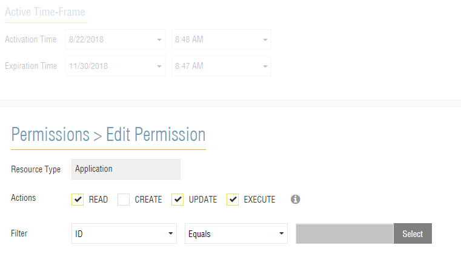

= OPENTLC IPMI Host
== Introduction

This document explains how the OPENTLC IPMI Host for Ravello works and is implemented.

== Background

Ravello provided to us Python code that can be used to serve as an IPMI baseboard management controller emulator for Ravello VMs.
The original code is available at https://github.com/benoit-canet/ravellobmc
The only useful file in that repo is the `ravellobmc.py` file.  Do not copy the `ravello_sdk.py` file as it is not useful.  In order to use this, you must
install the Python 2.x module named `pyghmi`.  This is python code that emulates an IPMI interface.
Further you will need the Ravello Python SDK installed.

== Components

The OPENTLC IPMI host has a modified version of `ravellobmc.py` in `/usr/local/bin`.  In this directory is also a wrapper utility that is called by a custom `systemd`
service called `ravellobmc.service`.

=== Ephemeral Token

You must create an ephemeral token in Ravello that has Read, Update, and Execute permissions for the application.

=== Wrapper

In `/usr/local/bin` there are two files called `ravellobmc-wrap.bash` and `ravellobmc-wrap.rb`.
The bash script is called by the service defined in `/etc/systemd/system/ravellobmc.service`.
The bash script will pause for 15 seconds to let cloud-init finish intializing.
It then looks for a file at `/etc/ravellobmc/ravellobmc.conf`.
This file contains the ephemeral token created to manage the application.  The contents of the file should look like this:
----
ephTok={your token}
----
It is assumed that you create the configuration file with a cloud-init script.
The script then runs the `ravellobmc.rb` with the ephemeral token as an argument.
The ruby portion of the wrapper takes the ephemeral token as an argument.  It then figures out what the Ravello application ID is for the application it is running in.
It will then kill any running ravellobmc.py processes.  Next it will read all of the application information from Ravello via the API.  It will search
for any VM that has the following text in its description:
----
ipmiaddr:{ip address}
ipmipw:{ipmi password}
----
It is assumed that any VM you set up for IPMI will have these settings in its *Description* field.  The IP address provided must be on the same subnet as the IPMI host.
The wrapper will then add this IP Address to the eth0 interface and start up the `ravellobmc.py` script with the necessary flags.

=== `ravellobmc.py`

This script defines the IPMI listener and logs into Ravello to manage the VMs depending on the IPMI call.  It has been modified to handle power on, power off,
power status, set boot device using raw (disk and pxe only), and to ignore any raw commands it does not understand.

== Setting Boot Device

The `ravellobmc.py` script can set the boot device as follows:

----
set disk boot: # ipmitool -I lanplus -U admin -P redhat -H 10.10.10.12 raw 0x00 0x08 0x05 0xe0 0x08 0x00 0x00 0x00
set pxe boot:  # ipmitool -I lanplus -U admin -P redhat -H 10.10.10.12 raw 0x00 0x08 0x05 0xe0 0x04 0x00 0x00 0x00
----

On the Ravello side, it is expected that your IPMI managed VMs have a disk and a CDROM with the ipxe
